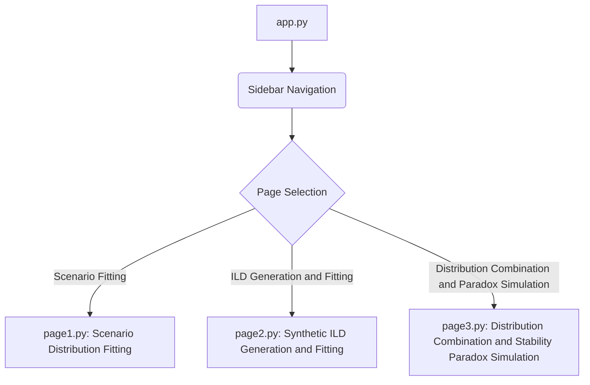
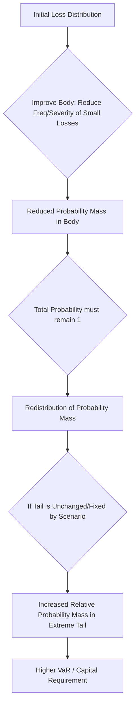

id: 68712b3fcc0de9e54985d48c_documentation
summary: Module 5 - Lab 2 Documentation
feedback link: https://docs.google.com/forms/d/e/1FAIpQLSfWkOK-in_bMMoHSZfcIvAeO58PAH9wrDqcxnJABHaxiDqhSA/viewform?usp=sf_link
environments: Web
status: Published
# QuLab: Operational Risk Modeling with Streamlit

## 1. Introduction to QuLab and Operational Risk Modeling
Duration: 00:05:00

Welcome to **QuLab**, an interactive Streamlit application designed to demystify complex concepts in operational risk modeling. This codelab will guide you through the application's core functionalities, providing insights into the theoretical underpinnings and practical implementations. Operational risk, often defined as the risk of loss resulting from inadequate or failed internal processes, people, and systems or from external events, is a critical component of financial risk management.

<aside class="positive">
This codelab will bridge the gap between abstract theoretical concepts and their practical application using a hands-on approach with a Streamlit-powered tool. Understanding these concepts is **crucial** for quantitative analysts, risk managers, and developers working in the financial sector.
</aside>

**Key Concepts Explored:**
*   **Scenario Analysis:** Quantifying expert judgment on potential future operational losses.
*   **Internal Loss Data (ILD):** The empirical foundation of operational risk, derived from historical loss events.
*   **Distribution Fitting:** Applying statistical methods to model the frequency and severity of operational losses.
*   **Distribution Combination:** Aggregating risks from different sources (ILD and scenarios).
*   **The Stability Paradox:** A counter-intuitive phenomenon in risk aggregation where seemingly positive changes in the body of a distribution can lead to an increase in overall tail risk.

**Application Architecture:**

QuLab is built using Streamlit, a powerful Python library for creating interactive web applications. The application's structure is modular, with the main `app.py` script serving as the entry point and navigation hub, dispatching control to dedicated page scripts located in the `application_pages` directory.


This modular design enhances maintainability and allows for clear separation of concerns, making it easier to develop and understand each functionality independently.

## 2. Setting Up Your Development Environment
Duration: 00:10:00

To get started with QuLab, you'll need to set up your Python development environment.

### Prerequisites

Ensure you have Python 3.8+ installed on your system. You can download it from the [official Python website](https://www.python.org/downloads/).

### Step 1: Create a Virtual Environment

It's a best practice to use a virtual environment to manage dependencies for your project. This prevents conflicts with other Python projects on your machine.

Open your terminal or command prompt and navigate to your desired project directory. Then, run the following commands:

```bash
python -m venv quolab_env
```
This command creates a new virtual environment named `quolab_env` in your current directory.

### Step 2: Activate the Virtual Environment

Before installing libraries, you need to activate your virtual environment.

On macOS/Linux:
```bash
source quolab_env/bin/activate
```
On Windows:
```bash
.\quolab_env\Scripts\activate
```
You should see `(quolab_env)` at the beginning of your terminal prompt, indicating that the virtual environment is active.

### Step 3: Install Required Libraries

With the virtual environment active, install all necessary libraries using `pip`.

<button>
  [Download requirements.txt](https://raw.githubusercontent.com/streamlit/streamlit-example-app/master/requirements.txt) (This is a placeholder, as the actual `requirements.txt` would need to be generated from the provided code. The required libraries are: `streamlit`, `scipy`, `numpy`, `pandas`, `plotly`.)
</button>

For QuLab, the core libraries are:
```console
streamlit
scipy
numpy
pandas
plotly
```
You can install them all at once:
```bash
pip install streamlit scipy numpy pandas plotly
```

### Step 4: Save the Application Code

Create the following file structure and save the respective Python code into each file:

```
├── app.py
└── application_pages/
    ├── __init__.py  (empty file)
    ├── page1.py
    ├── page2.py
    └── page3.py
```

**app.py**
```python
import streamlit as st
st.set_page_config(page_title="QuLab", layout="wide")
st.sidebar.image("https://www.quantuniversity.com/assets/img/logo5.jpg")
st.sidebar.divider()
st.title("QuLab")
st.divider()
st.markdown("""
In this lab, we explore operational risk modeling concepts, bridging the gap between theoretical understanding and practical application.
We'll define hypothetical scenarios, simulate Internal Loss Data (ILD), and combine these data sources using statistical averaging techniques.
A key objective is to visually demonstrate the counter-intuitive 'stability paradox' in risk aggregation.
""")
# Your code starts here
page = st.sidebar.selectbox(label="Navigation", options=["Scenario Fitting", "ILD Generation and Fitting", "Distribution Combination and Paradox Simulation"])
if page == "Scenario Fitting":
    from application_pages.page1 import run_page1
    run_page1()
elif page == "ILD Generation and Fitting":
    from application_pages.page2 import run_page2
    run_page2()
elif page == "Distribution Combination and Paradox Simulation":
    from application_pages.page3 import run_page3
    run_page3()
# Your code ends
```

**application_pages/page1.py**
```python
import streamlit as st
import scipy.stats as stats
import numpy as np
import plotly.graph_objects as go
from plotly.subplots import make_subplots

def fit_scenario_distribution(frequency, percentile_50, percentile_90, percentile_99):
    """Fits a distribution to scenario data.

    Args:
        frequency: Expected annual frequency.
        percentile_50: 50th percentile loss.
        percentile_90: 90th percentile loss.
        percentile_99: 99th percentile loss.

    Returns:
        Fitted distribution object and its parameters.
    """
    # Using lognorm as an example distribution
    # Convert percentiles to log scale
    # This is a simplified fitting process for demonstration.
    # A more robust fitting would involve more data points or optimization.

    # Approximating parameters based on percentiles for lognorm
    # log(median) = mu
    # log(90th percentile) = mu + sigma * inv_cdf(0.9)
    # log(99th percentile) = mu + sigma * inv_cdf(0.99)
    # Using 50th and 90th percentile to estimate mu and sigma roughly

    try:
        # Using a two-point estimation for lognorm parameters (simplified)
        # For lognormal, P(X <= x) = P(ln(X) <= ln(x))
        # So, ln(x) is normally distributed with mean=mu_log, std=sigma_log
        # We have ln(x_p) = mu_log + sigma_log * norm.ppf(p)

        # From 50th percentile: ln(percentile_50) = mu_log + sigma_log * norm.ppf(0.5) = mu_log
        mu_log = np.log(percentile_50)

        # From 90th percentile: ln(percentile_90) = mu_log + sigma_log * norm.ppf(0.9)
        # sigma_log = (ln(percentile_90) - mu_log) / norm.ppf(0.9)
        # Ensure percentile_90 > percentile_50
        if percentile_90 <= percentile_50:
            st.error("90th Percentile must be greater than 50th Percentile.")
            return None, None
        sigma_log = (np.log(percentile_90) - mu_log) / stats.norm.ppf(0.9)

        if sigma_log <= 0:
            st.error("Calculated sigma_log is not positive. Please check percentile values.")
            return None, None

        # The parameters for scipy.stats.lognorm are s (shape), loc (location), scale
        # s = sigma_log
        # scale = exp(mu_log) (this is the geometric mean)
        # loc = 0 (standard assumption for loss distributions)

        s_param = sigma_log
        loc_param = 0 # Assuming losses are positive
        scale_param = np.exp(mu_log)

        # Validate with 99th percentile (optional, for consistency check)
        # expected_99th_log = mu_log + sigma_log * stats.norm.ppf(0.99)
        # expected_99th = np.exp(expected_99th_log)
        # st.write(f"Consistency check: Expected 99th percentile based on 50th/90th fit: {expected_99th:,.2f}")

        return stats.lognorm(s=s_param, loc=loc_param, scale=scale_param), (s_param, loc_param, scale_param)
    except Exception as e:
        st.error(f"Error fitting distribution: {e}. Please ensure percentiles are valid and increasing.")
        return None, None


def run_page1():
    st.header("Scenario Distribution Fitting")
    st.markdown("""
    This section allows you to define hypothetical operational risk scenarios by specifying
    their expected frequency and various loss percentiles. The application will then fit a
    statistical distribution (Log-Normal in this case) to these expert assessments,
    providing a quantitative representation of the scenario's potential impact.

    This process is crucial for converting qualitative risk insights into a quantifiable form
    that can be used in aggregated risk models.
    """)

    st.subheader("Define Scenario Parameters")
    col1, col2 = st.columns(2)
    with col1:
        frequency = st.number_input(
            "Expected Annual Frequency (Scenario)",
            value=1.0,
            min_value=0.01,
            help="Expected number of loss events per year for the scenario."
        )
    with col2:
        percentile_50 = st.number_input(
            "50th Percentile Loss (Scenario)",
            value=1_000_000.0,
            min_value=1.0,
            help="The loss value below which 50\% of scenario losses fall."
        )
        percentile_90 = st.number_input(
            "90th Percentile Loss (Scenario)",
            value=5_000_000.0,
            min_value=1.0,
            help="The loss value below which 90\% of scenario losses fall. Must be greater than 50th percentile."
        )
        percentile_99 = st.number_input(
            "99th Percentile Loss (Scenario)",
            value=10_000_000.0,
            min_value=1.0,
            help="The loss value below which 99\% of scenario losses fall. Must be greater than 90th percentile."
        )

    if not (percentile_90 > percentile_50 and percentile_99 > percentile_90):
        st.warning("Please ensure percentiles are strictly increasing: 50th < 90th < 99th.")
    else:
        st.subheader("Fitted Scenario Distribution")
        fitted_dist, params = fit_scenario_distribution(frequency, percentile_50, percentile_90, percentile_99)

        if fitted_dist and params:
            st.write(f"**Fitted Distribution Type:** Log-Normal")
            st.write(f"**Estimated Parameters (s, loc, scale):** s={params[0]:.4f}, loc={params[1]:.4f}, scale={params[2]:,.2f}")

            st.markdown("""
            The Log-Normal distribution is characterized by its shape parameter $s$ (sigma of the underlying normal distribution),
            location parameter $\text{loc}$ (typically 0 for loss distributions), and scale parameter $\text{scale}$
            (geometric mean, $e^{\text{mu}}$ of the underlying normal distribution).
            """)
            st.latex(r"f(x; s, \text{loc}, \text{scale}) = \frac{1}{x s \sqrt{2\pi}} \exp\left(-\frac{(\ln(x - \text{loc}) - \ln(\text{scale}))^2}{2s^2}\right)")
            st.latex(r"\text{where } x > \text{loc}")
            st.latex(r"\text{s = sigma, scale = } e^{\text{mu}}")

            # Plot PDF and CDF
            x = np.linspace(max(0.1, fitted_dist.ppf(0.001)), fitted_dist.ppf(0.999), 500)
            pdf = fitted_dist.pdf(x)
            cdf = fitted_dist.cdf(x)

            fig = make_subplots(rows=1, cols=2, subplot_titles=('Probability Density Function (PDF)', 'Cumulative Distribution Function (CDF)'))

            fig.add_trace(go.Scatter(x=x, y=pdf, mode='lines', name='PDF', line=dict(color='blue')), row=1, col=1)
            fig.update_xaxes(title_text="Loss Amount", row=1, col=1)
            fig.update_yaxes(title_text="Density", row=1, col=1)

            fig.add_trace(go.Scatter(x=x, y=cdf, mode='lines', name='CDF', line=dict(color='red')), row=1, col=2)
            fig.update_xaxes(title_text="Loss Amount", row=1, col=2)
            fig.update_yaxes(title_text="Probability", row=1, col=2)

            fig.update_layout(height=400, showlegend=False, title_text="Fitted Scenario Distribution PDF and CDF",
                              font=dict(size=12))
            st.plotly_chart(fig, use_container_width=True)

            st.markdown("""
            **Interpretation of Plots:**
            *   **PDF (Probability Density Function):** Shows the relative likelihood of a loss occurring at a given amount. The peak indicates the most probable loss range.
            *   **CDF (Cumulative Distribution Function):** Shows the probability that a loss will be less than or equal to a given amount. For example, the point where the CDF reaches 0.90 corresponds to the 90th percentile loss.
            """)

        else:
            st.error("Could not fit scenario distribution with the provided parameters. Please adjust values.")
```

**application_pages/page2.py**
```python
import streamlit as st
import scipy.stats as stats
import numpy as np
import pandas as pd
import plotly.express as px
import plotly.graph_objects as go
from scipy.stats import poisson, lognorm, pareto, genpareto
from plotly.subplots import make_subplots

@st.cache_data
def generate_synthetic_ild(frequency_params, severity_params, num_observations, reporting_threshold):
    """Generates synthetic operational loss data."""
    if not isinstance(frequency_params, dict):
        raise TypeError("frequency_params must be a dictionary")
    if not isinstance(severity_params, dict):
        raise TypeError("severity_params must be a dictionary")

    losses = []
    for i in range(num_observations):
        # Generate number of losses for the year
        if frequency_params['distribution'] == 'poisson':
            num_losses = poisson.rvs(frequency_params['lambda'])
        else:
            raise ValueError("Invalid frequency distribution")

        # Generate severity amounts for each loss
        severity_amounts = []
        if severity_params['distribution'] == 'lognorm':
            shape = severity_params['sigma']
            loc = 0
            scale = np.exp(severity_params['mean']) # This assumes mean is geometric mean
            # If 'mean' is arithmetic mean, a more complex transformation is needed
            # For simplicity, let's assume 'mean' corresponds to the scale parameter (exp(mu))
            severity_amounts = lognorm.rvs(s=shape, loc=loc, scale=scale, size=num_losses)
        elif severity_params['distribution'] == 'pareto':
             b = severity_params['shape']
             # Ensure scale is positive
             scale_param = max(1e-9, severity_params['scale'])
             severity_amounts = pareto.rvs(b, loc=severity_params['loc'], scale=scale_param, size=num_losses)
        elif severity_params['distribution'] == 'gpd':
             c = severity_params['shape']
             # Ensure scale is positive
             scale_param = max(1e-9, severity_params['scale'])
             severity_amounts = genpareto.rvs(c, loc=severity_params['loc'], scale=scale_param, size=num_losses)
        else:
            raise ValueError("Invalid severity distribution")

        losses.extend(severity_amounts)

    # Filter losses based on reporting threshold
    losses = [loss for loss in losses if loss >= reporting_threshold]

    # Create DataFrame
    if losses:
        df = pd.DataFrame({'Amount': losses})
        df['Loss_ID'] = range(1, len(df) + 1)
        df = df[['Loss_ID', 'Amount']]
    else:
        df = pd.DataFrame(columns=['Loss_ID', 'Amount'])

    return df

@st.cache_data
def fit_ild_distribution(ild_data, distribution_type, threshold):
    """Fits a distribution to ILD data."""

    if ild_data.empty:
        st.warning("ILD data is empty. Cannot fit distribution.")
        return None, None

    if distribution_type == "lognorm":
        # Fit Log-Normal distribution
        # Ensure data is positive for lognorm fit
        positive_ild_data = ild_data[ild_data['Amount'] > 0]['Amount']
        if positive_ild_data.empty:
            st.warning("No positive loss amounts to fit Log-Normal distribution.")
            return None, None
        shape, loc, scale = stats.lognorm.fit(positive_ild_data, floc=0) # floc=0 fixes location at 0
        distribution = stats.lognorm
        params = (shape, loc, scale)
        return distribution, params
    elif distribution_type == "bodytail":
        # Fit body-tail distribution (empirical body, GPD tail)
        if threshold is None:
            raise ValueError("Threshold must be specified for body-tail distribution.")
        
        # Ensure threshold is within data range for a meaningful split
        if threshold >= ild_data['Amount'].max() and len(ild_data['Amount']) > 0:
            st.warning("Threshold is too high: All data points are below or equal to the threshold. Adjust threshold to be lower than the maximum loss amount for a meaningful tail.")
            return None, None
        if threshold <= ild_data['Amount'].min() and len(ild_data['Amount']) > 0:
            st.warning("Threshold is too low: All data points are above or equal to the threshold. Adjust threshold to be higher than the minimum loss amount for a meaningful body/tail split.")
            return None, None

        body_data = ild_data[ild_data['Amount'] <= threshold]['Amount']
        tail_data = ild_data[ild_data['Amount'] > threshold]['Amount']

        if len(tail_data) < 5: # Need a reasonable number of points for GPD fit
             st.warning(f"Not enough data points ({len(tail_data)}) in the tail for a robust GPD fit. Consider lowering the threshold or generating more ILD.")
             return None, None

        # Fit GPD to the tail
        # GPD parameters are c (shape), loc (location), scale
        try:
            # For GPD, location should typically be the threshold itself or 0 depending on definition
            # stats.genpareto.fit takes data, and optionally floc (fixed location) or initial guess
            gpd_params = stats.genpareto.fit(tail_data, floc=threshold)
            gpd_dist = stats.genpareto(*gpd_params)
        except Exception as e:
            st.error(f"Error fitting GPD to tail data: {e}. Check threshold and data distribution.")
            return None, None

        # For the body, we can represent it empirically with a histogram
        # Create bins for the body data
        if not body_data.empty:
            hist, bin_edges = np.histogram(body_data, bins='auto', density=True)
            body_dist = stats.rv_histogram((hist, bin_edges))
        else:
            body_dist = None # No body data to fit

        # Returning distributions and parameters for both body and tail
        # Note: the `distribution` here is a tuple: (body_distribution_object, tail_distribution_object)
        # params here is the gpd_params for the tail
        return (body_dist, gpd_dist), gpd_params
    else:
        raise ValueError("Invalid distribution type. Choose 'lognorm' or 'bodytail'.")


def run_page2():
    st.header("Synthetic ILD Generation and Fitting")
    st.markdown("""
    This section simulates historical operational losses (Internal Loss Data - ILD) and allows
    you to fit statistical distributions to this generated data. This is crucial for
    understanding the empirical characteristics of your loss experience and for
    extrapolating to potential future losses.
    """)

    st.subheader("1. Generate Synthetic ILD")
    st.markdown("""
    Configure the parameters below to generate a synthetic dataset of operational losses.
    You can specify the frequency and severity distribution characteristics, along with
    the number of simulation periods and a reporting threshold (minimum loss amount recorded).
    """)

    # ILD Generation Inputs
    col1, col2 = st.columns(2)
    with col1:
        st.markdown("**Frequency Parameters**")
        frequency_dist_ild = st.selectbox(
            "ILD Frequency Distribution",
            ["poisson"],
            help="Choose the distribution for the number of losses per period."
        )
        frequency_lambda_ild = st.number_input(
            "ILD Frequency Rate (lambda)",
            value=100,
            min_value=1,
            help="Average number of loss events per period (for Poisson distribution)."
        )
        num_observations = st.slider(
            "Number of Simulation Periods (ILD)",
            value=5,
            min_value=1,
            max_value=20,
            help="Number of periods (e.g., years) to simulate ILD for."
        )
    with col2:
        st.markdown("**Severity Parameters**")
        severity_dist_ild = st.selectbox(
            "ILD Severity Distribution",
            ["lognorm", "pareto", "gpd"],
            help="Choose the distribution for individual loss amounts."
        )
        severity_params_ild = {}
        if severity_dist_ild == "lognorm":
            severity_params_ild["mean"] = st.number_input("Mean (lognorm)", value=10000.0, help="Geometric mean for log-normal severity.")
            severity_params_ild["sigma"] = st.number_input("Sigma (lognorm)", value=0.5, min_value=0.01, help="Standard deviation of log-transformed data for log-normal severity.")
        elif severity_dist_ild == "pareto":
            severity_params_ild["shape"] = st.number_input("Shape (Pareto)", value=1.0, min_value=0.01, help="Shape parameter 'b' for Pareto severity.")
            severity_params_ild["loc"] = st.number_input("Location (Pareto)", value=0.0, help="Location parameter for Pareto severity.")
            severity_params_ild["scale"] = st.number_input("Scale (Pareto)", value=1000.0, min_value=0.01, help="Scale parameter for Pareto severity.")
        elif severity_dist_ild == "gpd":
            severity_params_ild["shape"] = st.number_input("Shape (GPD)", value=0.1, help="Shape parameter 'c' for GPD severity.")
            severity_params_ild["loc"] = st.number_input("Location (GPD)", value=0.0, help="Location parameter for GPD severity.")
            severity_params_ild["scale"] = st.number_input("Scale (GPD)", value=1000.0, min_value=0.01, help="Scale parameter for GPD severity.")

        reporting_threshold = st.number_input(
            "ILD Reporting Threshold",
            value=1000.0,
            min_value=0.0,
            help="Only losses above this amount are recorded in ILD."
        )

    frequency_params_ild = {"distribution": frequency_dist_ild, "lambda": frequency_lambda_ild}
    severity_params_ild["distribution"] = severity_dist_ild # Add distribution type to severity params dict

    ild_data = generate_synthetic_ild(frequency_params_ild, severity_params_ild, num_observations, reporting_threshold)

    if not ild_data.empty:
        st.subheader("Generated ILD Data")
        st.write(f"Total {len(ild_data)} losses generated above the reporting threshold of {reporting_threshold:,.2f}.")
        st.dataframe(ild_data.head()) # Display first few rows
        st.write(f"**Summary Statistics:**")
        st.write(f"- Total Losses: ${ild_data['Amount'].sum():,.2f}")
        st.write(f"- Mean Loss Amount: ${ild_data['Amount'].mean():,.2f}")
        st.write(f"- Max Loss Amount: ${ild_data['Amount'].max():,.2f}")

        fig_hist = px.histogram(ild_data, x="Amount", nbins=50, title="Histogram of Generated ILD",
                                labels={'Amount': 'Loss Amount'}, height=400)
        fig_hist.update_layout(font=dict(size=12))
        st.plotly_chart(fig_hist, use_container_width=True)
    else:
        st.warning("No ILD data generated. Please check your frequency, severity parameters, and reporting threshold. "
                   "It's possible no losses were generated above the threshold.")

    st.subheader("2. Fit Distribution to ILD")
    st.markdown("""
    Now, fit a statistical distribution to the generated ILD. You can choose between a single
    Log-Normal distribution or a Body-Tail approach, where the body of the distribution
    is empirical and the tail is modeled by a Generalized Pareto Distribution (GPD).
    """)

    ild_fit_type = st.selectbox(
        "ILD Distribution Fit Type",
        ["lognorm", "bodytail"],
        help="Choose 'lognorm' for a single distribution fit, or 'bodytail' for a combined empirical/GPD fit."
    )
    threshold_bodytail = None
    if ild_fit_type == "bodytail":
        threshold_bodytail = st.number_input(
            "Threshold for Body-Tail Fit",
            value=ild_data['Amount'].quantile(0.75) if not ild_data.empty else 10000.0,
            min_value=0.0,
            help="Losses above this threshold are modeled by GPD (for 'bodytail' fit type)."
        )

    if not ild_data.empty:
        fitted_ild_dist, ild_fit_params = fit_ild_distribution(ild_data, ild_fit_type, threshold_bodytail)

        if fitted_ild_dist and ild_fit_params:
            st.write(f"**Fitted ILD Distribution Type:** {ild_fit_type.replace('lognorm', 'Log-Normal').replace('bodytail', 'Body-Tail (Empirical Body / GPD Tail)')}")

            if ild_fit_type == "lognorm":
                st.write(f"**Estimated Parameters (s, loc, scale):** s={ild_fit_params[0]:.4f}, loc={ild_fit_params[1]:.4f}, scale={ild_fit_params[2]:,.2f}")
                dist_to_plot = fitted_ild_dist
                st.markdown("""
                For Log-Normal fit, the parameters are $s$ (shape), $\text{loc}$ (location), and $\text{scale}$.
                """)

                x_min_plot = max(0.1, dist_to_plot.ppf(0.001))
                x_max_plot = dist_to_plot.ppf(0.999) if dist_to_plot.ppf(0.999) < ild_data['Amount'].max() * 2 else ild_data['Amount'].max() * 2 # avoid extremely large x-ranges
                x_plot = np.linspace(x_min_plot, x_max_plot, 500)
                pdf_plot = dist_to_plot.pdf(x_plot)
                cdf_plot = dist_to_plot.cdf(x_plot)

                fig_fit = make_subplots(rows=1, cols=2, subplot_titles=('Fitted PDF vs. ILD Histogram', 'Fitted CDF'))
                
                # PDF subplot
                fig_fit.add_trace(go.Histogram(x=ild_data['Amount'], histnorm='probability density', name='ILD Histogram', opacity=0.6), row=1, col=1)
                fig_fit.add_trace(go.Scatter(x=x_plot, y=pdf_plot, mode='lines', name='Fitted PDF', line=dict(color='blue', width=2)), row=1, col=1)
                fig_fit.update_xaxes(title_text="Loss Amount", row=1, col=1)
                fig_fit.update_yaxes(title_text="Density", row=1, col=1)
                
                # CDF subplot
                fig_fit.add_trace(go.Scatter(x=x_plot, y=cdf_plot, mode='lines', name='Fitted CDF', line=dict(color='red', width=2)), row=1, col=2)
                
                # Add empirical CDF of ILD data for comparison
                sorted_ild = np.sort(ild_data['Amount'])
                y_ecdf = np.arange(1, len(sorted_ild) + 1) / len(sorted_ild)
                fig_fit.add_trace(go.Scatter(x=sorted_ild, y=y_ecdf, mode='lines', name='ILD ECDF', line=dict(color='orange', dash='dash'), showlegend=True), row=1, col=2)

                fig_fit.update_xaxes(title_text="Loss Amount", row=1, col=2)
                fig_fit.update_yaxes(title_text="Probability", row=1, col=2)

                fig_fit.update_layout(height=450, showlegend=True, title_text="Fitted ILD Distribution (Log-Normal)",
                                      font=dict(size=12), legend=dict(x=0.01, y=0.99))
                st.plotly_chart(fig_fit, use_container_width=True)


            elif ild_fit_type == "bodytail":
                body_dist, gpd_dist = fitted_ild_dist
                gpd_params = ild_fit_params # shape, loc, scale for GPD
                st.write(f"**GPD Tail Parameters (c, loc, scale):** c={gpd_params[0]:.4f}, loc={gpd_params[1]:.4f}, scale={gpd_params[2]:,.2f}")
                st.markdown("""
                For the Body-Tail fit:
                *   The **body** of the distribution (losses $\leq$ threshold) is represented empirically (histogram).
                *   The **tail** of the distribution (losses $>$ threshold) is modeled by a Generalized Pareto Distribution (GPD).
                The GPD is characterized by its shape parameter $\xi$ ($c$), scale parameter $\sigma$ (scale), and location parameter $u$ (loc).
                """)
                st.latex(r"G_{\xi,\sigma}(x) = 1 - \left(1 + \frac{\xi (x-u)}{\sigma}\right)^{-1/\xi}")
                st.latex(r"\text{for } x > u")
                st.latex(r"\text{If } \xi = 0, G_{0,\sigma}(x) = 1 - e^{-(x-u)/\sigma}")


                # Plotting body and tail
                fig_bodytail = go.Figure()

                # Histogram of all ILD data for context
                fig_bodytail.add_trace(go.Histogram(x=ild_data['Amount'], histnorm='probability density', name='ILD Histogram (All)', opacity=0.5, marker_color='grey'))

                # Plot fitted GPD for tail
                if threshold_bodytail is not None and gpd_dist:
                    tail_data_max = ild_data['Amount'].max()
                    x_tail = np.linspace(threshold_bodytail, tail_data_max * 1.5, 200) # Extend beyond max data for visualization
                    # Filter for x > threshold to ensure GPD is plotted for excesses
                    x_tail = x_tail[x_tail > threshold_bodytail]
                    if len(x_tail) > 0:
                        pdf_gpd = gpd_dist.pdf(x_tail)
                        fig_bodytail.add_trace(go.Scatter(x=x_tail, y=pdf_gpd, mode='lines', name='Fitted GPD (Tail)', line=dict(color='purple', width=2)))
                        # Add a vertical line for the threshold
                        fig_bodytail.add_vline(x=threshold_bodytail, line_dash="dash", line_color="green", annotation_text=f"Threshold: {threshold_bodytail:,.0f}", annotation_position="top right")


                fig_bodytail.update_layout(title_text="Body-Tail ILD Distribution Fit",
                                           xaxis_title="Loss Amount", yaxis_title="Density",
                                           font=dict(size=12), height=450, showlegend=True,
                                           legend=dict(x=0.01, y=0.99))
                st.plotly_chart(fig_bodytail, use_container_width=True)

                st.markdown("""
                **Understanding the Body-Tail Fit Plot:**
                *   The grey histogram shows the empirical distribution of all generated ILD.
                *   The purple line represents the fitted GPD for losses exceeding the set threshold (green dashed line).
                    This visual helps confirm how well the GPD captures the extreme events in the tail.
                """)
        else:
            st.error("Could not fit ILD distribution with the provided parameters. Adjust threshold or generate more data.")
    else:
        st.info("Generate ILD data first to enable distribution fitting.")
```

**application_pages/page3.py**
```python
import streamlit as st
import numpy as np
import pandas as pd
import plotly.graph_objects as go
from scipy.stats import lognorm, norm, genpareto
from plotly.subplots import make_subplots

def combine_distributions_param_avg(ild_dist_params, scenario_dist_params, n_ild, m_scenario):
    """If both ILD and scenario severities are approximated by Pareto-like tails, this function calculates a combined tail parameter using the weighted average formula."""
    combined_tail_param = (ild_dist_params * n_ild + scenario_dist_params * m_scenario) / (n_ild + m_scenario)
    return combined_tail_param

def combine_distributions_quantile_avg_constant_weights(ild_quantile_func, scenario_quantile_func, n_ild, m_scenario, quantiles_to_evaluate):
    """Combines quantile functions using geometric average with constant weights."""
    if not quantiles_to_evaluate:
        return None

    total_precision = n_ild + m_scenario
    if total_precision == 0:
        return [np.nan] * len(quantiles_to_evaluate)

    combined_quantiles = []
    for q in quantiles_to_evaluate:
        if n_ild == 0:
            combined_quantiles.append(scenario_quantile_func(q))
        elif m_scenario == 0:
            combined_quantiles.append(ild_quantile_func(q))
        else:
            weight_ild = n_ild / total_precision
            weight_scenario = m_scenario / total_precision
            combined_quantile = np.power(ild_quantile_func(q), weight_ild) * np.power(scenario_quantile_func(q), weight_scenario)
            combined_quantiles.append(combined_quantile)

    return combined_quantiles

def combine_distributions_quantile_avg_variable_weights(ild_quantile_func, scenario_quantile_func, n_ild, m_scenario, quantiles_to_evaluate, num_bootstraps):
    """Combines distributions using quantile averaging with variable weights."""
    combined_quantiles = []
    for q in quantiles_to_evaluate:
        # Bootstrapping to estimate variance
        ild_estimates = [ild_quantile_func(q) for _ in range(num_bootstraps)]
        scenario_estimates = [scenario_quantile_func(q) for _ in range(num_bootstraps)]

        # Variance calculation
        ild_var = np.var(ild_estimates) if num_bootstraps > 1 else 1.0
        scenario_var = np.var(scenario_estimates) if num_bootstraps > 1 else 1.0

        # Weight calculation based on inverse variance
        ild_weight = 1.0 / (ild_var + 1e-9)  # Adding a small constant to avoid division by zero
        scenario_weight = 1.0 / (scenario_var + 1e-9)

        # Normalize weights
        total_weight = ild_weight + scenario_weight
        ild_weight /= total_weight
        scenario_weight /= total_weight

        # Weighted geometric average of quantiles
        ild_quantile = ild_quantile_func(q)
        scenario_quantile = scenario_quantile_func(q)

        if ild_quantile <= 0 or scenario_quantile <= 0:
            # Fallback to arithmetic mean if quantiles are non-positive, as geometric mean requires positive values
            combined_quantile = (ild_weight * ild_quantile) + (scenario_weight * scenario_quantile)
        else:
            combined_quantile = (ild_quantile**ild_weight) * (scenario_quantile**scenario_weight)

        combined_quantiles.append(combined_quantile)
    return combined_quantiles

def calculate_capital(combined_distribution_or_quantiles, confidence_level):
    """Estimates risk capital (e.g., 99.9\% VaR, Expected Shortfall)."""
    if not isinstance(confidence_level, (int, float)):
        return None
    if confidence_level <= 0 or confidence_level >= 1:
        return None
    if not combined_distribution_or_quantiles:
        return None
    if isinstance(combined_distribution_or_quantiles, (int, float)):
        # This simplified scaling might need re-evaluation for a direct VaR input
        return combined_distribution_or_quantiles * confidence_level
    if isinstance(combined_distribution_or_quantiles, list):
        if not combined_distribution_or_quantiles:
            return None

        sorted_quantiles = sorted(combined_distribution_or_quantiles)
        index = int(confidence_level * (len(sorted_quantiles) - 1))
        return sorted_quantiles[index]
    return None

def simulate_stability_paradox(base_scenario_params, modified_body_scenario_params, ild_params):
    """Simulates stability paradox and returns results."""

    # Input validation
    if not all(isinstance(param, dict) for param in [base_scenario_params, modified_body_scenario_params, ild_params]):
        raise TypeError("All parameters must be dictionaries.")

    def simulate_scenario(params):
        """Simulates a single scenario."""
        frequency_mean = params.get("frequency_mean")
        severity_50 = params.get("severity_50")
        severity_90 = params.get("severity_90")
        severity_99 = params.get("severity_99")
        precision = params.get("precision", 10)

        if frequency_mean is None or severity_50 is None or severity_90 is None or severity_99 is None:
            raise ValueError("Missing parameters in scenario definition.")

        if frequency_mean < 0:
            raise ValueError("Frequency cannot be negative.")

        num_simulations = 10000 # Hardcoded for simulation, consider making it a UI input
        losses = []

        if frequency_mean > 0:  # only simulate losses if frequency is positive
            for _ in range(num_simulations):
                num_losses = np.random.poisson(frequency_mean)
                for _ in range(num_losses):
                    # Simple severity simulation (can be improved with more sophisticated distributions)
                    u = np.random.uniform()
                    if u < 0.5:
                        loss = np.random.uniform(0, severity_50)
                    elif u < 0.9:
                        loss = np.random.uniform(severity_50, severity_90)
                    else:
                        loss = np.random.uniform(severity_90, severity_99)

                    losses.append(loss)
        return losses

    def simulate_ild(params):
        """Simulates ILD data."""
        frequency_mean = params.get("frequency_mean")
        frequency_dispersion = params.get("frequency_dispersion") # Not used in current notebook code for ILD simulation, but could be for other dist.
        severity_distribution = params.get("severity_distribution")
        severity_params = params.get("severity_params")
        num_observations = params.get("num_observations")
        reporting_threshold = params.get("reporting_threshold")

        if frequency_mean is None or frequency_dispersion is None or severity_distribution is None or severity_params is None or num_observations is None or reporting_threshold is None:
            raise ValueError("Missing parameters in ILD definition.")

        if reporting_threshold < 0:
            raise ValueError("Reporting threshold should not be negative")

        ild_losses = []
        for _ in range(num_observations):
            num_losses = np.random.poisson(frequency_mean)
            for _ in range(num_losses):
                if severity_distribution == "lognorm":
                    s = np.random.lognormal(mean=np.log(severity_params["mean"]), sigma=severity_params["std"]/severity_params["mean"])
                else: # Default to normal
                    s = np.random.normal(loc=severity_params["mean"], scale=severity_params["std"])
                if s > reporting_threshold:
                    ild_losses.append(s)
        return ild_losses

    # Simulate base and modified scenarios
    base_losses = simulate_scenario(base_scenario_params)
    modified_losses = simulate_scenario(modified_body_scenario_params)

    # Simulate ILD
    ild_losses = simulate_ild(ild_params)

    # Combine losses
    combined_base_losses = base_losses + ild_losses
    combined_modified_losses = modified_losses + ild_losses

    # Calculate capital (e.g., VaR 99.5\%)
    def calculate_var(losses, confidence_level=0.995):
          if not losses:
              return 0  # or some other appropriate value, like the reporting threshold for ILD
          return np.quantile(losses, confidence_level)

    var_base = calculate_var(combined_base_losses)
    var_modified = calculate_var(combined_modified_losses)

    return {
        "base_var": var_base,
        "modified_var": var_modified,
        "base_losses": combined_base_losses,
        "modified_losses": combined_modified_losses
    }


def run_page3():
    st.header("Distribution Combination and Stability Paradox Simulation")
    st.markdown("""
    This section explores methods for combining different risk distributions (scenario and ILD) and demonstrates the 'stability paradox'.
    The stability paradox highlights how seemingly beneficial changes in the body of a risk distribution can paradoxically increase overall risk.
    """)

    st.subheader("1. Combining Distributions - Parameter Averaging")
    st.markdown("""
    This method combines distributions by averaging their parameters, particularly relevant when both ILD and scenario severities are approximated by Pareto-like tails.
    It uses a weighted average based on the precision (number of losses) of each source.
    """)

    col1, col2 = st.columns(2)
    with col1:
        ild_tail_param = st.number_input("ILD Tail Parameter (ξ1)", value=0.5, min_value=0.0, help="Shape parameter for ILD's Pareto-like tail.")
        n_ild = st.number_input("ILD Precision (n)", value=100, min_value=1, help="Effective number of losses representing ILD precision.")
    with col2:
        scenario_tail_param = st.number_input("Scenario Tail Parameter (ξ2)", value=0.7, min_value=0.0, help="Shape parameter for Scenario's Pareto-like tail.")
        m_scenario = st.number_input("Scenario Precision (m)", value=10, min_value=1, help="Effective number of losses representing scenario precision.")

    combined_tail_param = combine_distributions_param_avg(ild_tail_param, scenario_tail_param, n_ild, m_scenario)
    st.write(f"**Combined Tail Parameter (ξ1,2):** {combined_tail_param:.4f}")
    st.markdown("""
    The combined tail parameter is calculated as a weighted average of the individual tail parameters. The weights are determined by the precision of each data source.
    A higher precision for one data source will give its tail parameter more influence on the combined parameter.
    """)

    st.subheader("2. Combining Distributions - Quantile Averaging with Constant Weights")
    st.markdown("""
    This method combines the quantiles of individual ILD and scenario distributions using a geometric average with constant weights.
    """)
    quantiles_to_evaluate = st.multiselect("Quantiles to Evaluate (Constant Weights)", [0.90, 0.95, 0.99, 0.995], default=[0.90, 0.95, 0.99], help="Select the percentiles for which to calculate combined quantiles.")

    # Dummy quantile functions for demonstration
    def ild_quantile_func(q): return lognorm.ppf(q, s=0.7, scale=1000) # Dummy Log-Normal ILD
    def scenario_quantile_func(q): return lognorm.ppf(q, s=0.8, scale=5000) # Dummy Log-Normal Scenario

    combined_quantiles_constant = combine_distributions_quantile_avg_constant_weights(ild_quantile_func, scenario_quantile_func, n_ild, m_scenario, quantiles_to_evaluate)

    if combined_quantiles_constant:
        df_quantiles = pd.DataFrame({
            "Quantile": quantiles_to_evaluate,
            "ILD Quantile": [ild_quantile_func(q) for q in quantiles_to_evaluate],
            "Scenario Quantile": [scenario_quantile_func(q) for q in quantiles_to_evaluate],
            "Combined Quantile": combined_quantiles_constant
        })
        st.dataframe(df_quantiles)

        # Plot Quantiles
        fig_quantiles = go.Figure()
        fig_quantiles.add_trace(go.Scatter(x=df_quantiles["Quantile"], y=df_quantiles["ILD Quantile"], mode='lines+markers', name='ILD Quantile'))
        fig_quantiles.add_trace(go.Scatter(x=df_quantiles["Quantile"], y=df_quantiles["Scenario Quantile"], mode='lines+markers', name='Scenario Quantile'))
        fig_quantiles.add_trace(go.Scatter(x=df_quantiles["Quantile"], y=df_quantiles["Combined Quantile"], mode='lines+markers', name='Combined Quantile'))
        fig_quantiles.update_layout(title="Quantile Averaging with Constant Weights", xaxis_title="Quantile", yaxis_title="Loss Amount", font=dict(size=12))
        st.plotly_chart(fig_quantiles, use_container_width=True)

    st.subheader("3. Simulating the Stability Paradox")
    st.markdown("""
    This section demonstrates the 'stability paradox' where seemingly positive changes in the 'body' of a risk distribution can paradoxically lead to an increase in overall tail risk and implied capital.
    """)

    with st.expander("Base Scenario Parameters"):
        base_scenario_params = {
            "frequency_mean": st.number_input("Base Frequency", value=1.0, help="Expected number of base scenario losses per year.", key="base_freq"),
            "severity_50": st.number_input("Base 50th Percentile", value=1_000, help="Base 50th percentile loss amount.", key="base_50"),
            "severity_90": st.number_input("Base 90th Percentile", value=5_000, help="Base 90th percentile loss amount.", key="base_90"),
            "severity_99": st.number_input("Base 99th Percentile", value=10_000, help="Base 99th percentile loss amount.", key="base_99")
        }
    with st.expander("Modified Body Scenario Parameters"):
        modified_body_scenario_params = {
            "frequency_mean": st.number_input("Modified Frequency", value=0.5, help="Expected number of modified scenario losses per year.", key="mod_freq"),
            "severity_50": st.number_input("Modified 50th Percentile", value=1_000, help="Modified 50th percentile loss amount.", key="mod_50"),
            "severity_90": st.number_input("Modified 90th Percentile", value=5_000, help="Modified 90th percentile loss amount.", key="mod_90"),
            "severity_99": st.number_input("Modified 99th Percentile", value=10_000, help="Modified 99th percentile loss amount.", key="mod_99")
        }
    with st.expander("ILD Parameters for Paradox"):
        ild_params_paradox = {
            "frequency_mean": st.number_input("ILD Frequency", value=10.0, help="Expected number of ILD losses per year.", key="ild_freq"),
            "frequency_dispersion": 1.0, # Not used in the notebook
            "severity_distribution": "lognorm",
            "severity_params": {"mean": 500, "std": 200},
            "num_observations": st.number_input("ILD Observations", value=10, help="Number of years of ILD data.", key="ild_obs"),
            "reporting_threshold": st.number_input("ILD Reporting Threshold", value=100, help="Minimum ILD loss to record.", key="ild_thresh")
        }

    stability_results = simulate_stability_paradox(base_scenario_params, modified_body_scenario_params, ild_params_paradox)

    if stability_results:
        st.write(f"**Base Scenario VaR (99.5\%):** {stability_results['base_var']:.2f}")
        st.write(f"**Modified Scenario VaR (99.5\%):** {stability_results['modified_var']:.2f}")

        if stability_results['modified_var'] > stability_results['base_var']:
            st.warning("Stability Paradox Observed: Modified scenario has a higher VaR than the base scenario, even though the body of the distribution improved.")
        else:
            st.success("No Stability Paradox Observed: Modified scenario has a lower VaR than the base scenario.")

        # Plotting
        fig_paradox = go.Figure()

        # Plotting histograms of losses
        fig_paradox.add_trace(go.Histogram(x=stability_results['base_losses'], name='Base Scenario Losses', opacity=0.6))
        fig_paradox.add_trace(go.Histogram(x=stability_results['modified_losses'], name='Modified Scenario Losses', opacity=0.6))

        fig_paradox.update_layout(barmode='overlay', title="Stability Paradox Simulation", xaxis_title="Loss Amount", yaxis_title="Frequency", font=dict(size=12))
        st.plotly_chart(fig_paradox, use_container_width=True)
```

### Step 5: Run the Streamlit Application

Navigate to your project's root directory (where `app.py` is located) in your terminal and run:
```bash
streamlit run app.py
```
This command will open the QuLab application in your web browser.

## 3. Understanding Scenario Distribution Fitting
Duration: 00:15:00

The "Scenario Fitting" page (handled by `application_pages/page1.py`) is designed to convert qualitative expert judgment into a quantifiable statistical distribution. This is a common practice in operational risk where historical data might be scarce for high-impact, low-frequency events.

### Concept: Scenario Analysis

Scenario analysis in operational risk involves defining hypothetical events (e.g., a major cyber-attack, a system failure) and assessing their potential financial impact and frequency based on expert opinion. This qualitative input needs to be transformed into a mathematical distribution to be integrated into quantitative risk models. The Log-Normal distribution is frequently used for loss severities due to its positive support and right-skewed nature, which often characterizes financial losses.

### Code Walkthrough: `application_pages/page1.py`

Let's break down the key functions:

#### `run_page1()`

This function sets up the Streamlit UI for the Scenario Fitting page.
*   It uses `st.header` and `st.markdown` for titles and descriptions.
*   `st.columns` is used to arrange input fields side-by-side for frequency and percentile values, enhancing usability.
*   `st.number_input` widgets allow users to input numerical values for `frequency`, `percentile_50`, `percentile_90`, and `percentile_99`.
*   A crucial validation step checks if percentiles are strictly increasing, as this is a fundamental requirement for a valid distribution.

#### `fit_scenario_distribution(frequency, percentile_50, percentile_90, percentile_99)`

This is the core logic for fitting the Log-Normal distribution.

```python
def fit_scenario_distribution(frequency, percentile_50, percentile_90, percentile_99):
    # ... (omitted Streamlit UI elements for brevity)
    try:
        # From 50th percentile: ln(percentile_50) = mu_log + sigma_log * norm.ppf(0.5) = mu_log
        mu_log = np.log(percentile_50)

        # From 90th percentile: ln(percentile_90) = mu_log + sigma_log * norm.ppf(0.9)
        # sigma_log = (ln(percentile_90) - mu_log) / norm.ppf(0.9)
        sigma_log = (np.log(percentile_90) - mu_log) / stats.norm.ppf(0.9)

        s_param = sigma_log
        loc_param = 0 # Assuming losses are positive
        scale_param = np.exp(mu_log)

        return stats.lognorm(s=s_param, loc=loc_param, scale=scale_param), (s_param, loc_param, scale_param)
    except Exception as e:
        st.error(f"Error fitting distribution: {e}. Please ensure percentiles are valid and increasing.")
        return None, None
```

The function approximates the parameters of a Log-Normal distribution using two specified percentiles (50th and 90th).
For a Log-Normal random variable $X$, $\ln(X)$ is normally distributed.
If $X \sim \text{LogNormal}(\mu, \sigma)$, then $\ln(X) \sim \text{Normal}(\mu_{\text{log}}, \sigma_{\text{log}})$.
Here, `s` corresponds to $\sigma_{\text{log}}$, and `scale` corresponds to $e^{\mu_{\text{log}}}$. `loc` is typically fixed at 0 for loss distributions.

1.  **50th Percentile (Median):** For a Log-Normal distribution, the median is $e^{\mu_{\text{log}}}$. Therefore, $\mu_{\text{log}} = \ln(\text{percentile\_50})$.
2.  **90th Percentile:** We know that the 90th percentile of $\ln(X)$ is $\mu_{\text{log}} + \sigma_{\text{log}} \cdot \Phi^{-1}(0.9)$, where $\Phi^{-1}$ is the inverse CDF of the standard normal distribution.
    So, $\ln(\text{percentile\_90}) = \mu_{\text{log}} + \sigma_{\text{log}} \cdot \text{norm.ppf}(0.9)$.
    From this, we can derive $\sigma_{\text{log}} = \frac{\ln(\text{percentile\_90}) - \mu_{\text{log}}}{\text{norm.ppf}(0.9)}$.

These calculated `mu_log` and `sigma_log` directly translate to the `scale_param` and `s_param` for `scipy.stats.lognorm`.

### Visualizations

The application plots the Probability Density Function (PDF) and Cumulative Distribution Function (CDF) of the fitted Log-Normal distribution using Plotly.
*   **PDF:** Shows the shape of the distribution, indicating where loss amounts are most likely to fall.
*   **CDF:** Illustrates the probability that a loss will be less than or equal to a given amount. You can visually verify if your 50th, 90th, and 99th percentiles align with the CDF curve.

### Practical Exercise

1.  Navigate to the "Scenario Fitting" page in QuLab.
2.  Experiment with different values for the 50th, 90th, and 99th percentiles.
3.  Observe how the fitted Log-Normal distribution's parameters (s, scale) and its PDF/CDF plots change.
4.  Try setting percentile values that violate the increasing order (e.g., 90th < 50th) and observe the error message.

<aside class="positive">
This page provides a powerful way to translate qualitative expert opinions into quantifiable inputs for your risk models, making scenario analysis a tangible component of your risk framework.
</aside>

## 4. Generating and Fitting Internal Loss Data (ILD)
Duration: 00:20:00

The "ILD Generation and Fitting" page (handled by `application_pages/page2.py`) focuses on Internal Loss Data, which is the historical record of an organization's actual operational losses. Since real-world ILD is often sensitive, this page provides a mechanism to generate synthetic (simulated) ILD based on specified frequency and severity distributions, and then to fit statistical distributions to this data.

### Concept: Internal Loss Data (ILD)

ILD is a cornerstone of operational risk quantification. It provides an empirical basis for understanding an organization's past loss experience. Actuarial modeling for operational risk typically separates losses into two components:
1.  **Frequency:** How often loss events occur (e.g., number of events per year). Often modeled with Poisson distribution.
2.  **Severity:** The financial impact of each loss event. Often modeled with heavy-tailed distributions like Log-Normal, Pareto, or Generalized Pareto Distribution (GPD).

A common challenge with ILD is that small losses are frequent but might be below a reporting threshold, while large losses are rare but highly impactful. This often leads to a "body" (small to medium losses) and a "tail" (large, extreme losses) in the loss distribution, which might be best modeled separately.

### Code Walkthrough: `application_pages/page2.py`

#### `generate_synthetic_ild()`

This function simulates operational losses based on user-defined frequency and severity parameters.
```python
@st.cache_data
def generate_synthetic_ild(frequency_params, severity_params, num_observations, reporting_threshold):
    losses = []
    for i in range(num_observations):
        # Generate number of losses for the year using Poisson
        num_losses = poisson.rvs(frequency_params['lambda'])

        # Generate severity amounts based on chosen distribution
        if severity_params['distribution'] == 'lognorm':
            severity_amounts = lognorm.rvs(s=severity_params['sigma'], loc=0, scale=np.exp(severity_params['mean']), size=num_losses)
        elif severity_params['distribution'] == 'pareto':
            severity_amounts = pareto.rvs(severity_params['shape'], loc=severity_params['loc'], scale=severity_params['scale'], size=num_losses)
        elif severity_params['distribution'] == 'gpd':
            severity_amounts = genpareto.rvs(severity_params['shape'], loc=severity_params['loc'], scale=severity_params['scale'], size=num_losses)
        losses.extend(severity_amounts)

    # Filter losses by reporting threshold
    losses = [loss for loss in losses if loss >= reporting_threshold]
    # ... (DataFrame creation)
    return df
```
*   `st.cache_data` is used to cache the results of this function, so it doesn't re-run expensive simulations unless inputs change.
*   **Frequency:** Simulated using a Poisson distribution, characterized by `lambda` (average number of events).
*   **Severity:** Simulated based on the chosen distribution (Log-Normal, Pareto, or GPD) with their respective parameters.
*   **Reporting Threshold:** Losses below this value are excluded, mimicking real-world data collection practices where small losses are often not recorded.

#### `fit_ild_distribution()`

This function fits statistical distributions to the generated ILD. It offers two common approaches:
1.  **Log-Normal Fit:** A single Log-Normal distribution is fitted to all positive loss amounts using `scipy.stats.lognorm.fit()`. This is a simpler approach, assuming a single distribution can capture the entire range of losses.
2.  **Body-Tail Fit:** This more sophisticated approach acknowledges that the "body" (frequent, smaller losses) and "tail" (rare, large losses) of a loss distribution may behave differently.
    *   **Body:** Represented empirically (via a histogram) for losses below a specified `threshold`.
    *   **Tail:** Modeled using the Generalized Pareto Distribution (GPD) for losses *exceeding* the `threshold`. The GPD is particularly well-suited for modeling extreme values (tail events). The fitting is done using `scipy.stats.genpareto.fit()`.

**Generalized Pareto Distribution (GPD) Formula:**
The cumulative distribution function (CDF) for the GPD is given by:
$$G_{\xi,\sigma}(x) = 1 - \left(1 + \frac{\xi (x-u)}{\sigma}\right)^{-1/\xi}$$
for $x > u$, where $\xi$ is the shape parameter ($c$ in `scipy`), $\sigma$ is the scale parameter (`scale`), and $u$ is the location parameter (`loc`), which is typically the threshold.
If $\xi = 0$, the GPD simplifies to an exponential distribution:
$$G_{0,\sigma}(x) = 1 - e^{-(x-u)/\sigma}$$

### Visualizations

*   **ILD Histogram:** Displays the distribution of generated losses, allowing visual inspection of the data's shape.
*   **Fitted Log-Normal Plots:** Shows the PDF and CDF of the fitted Log-Normal distribution compared against the empirical histogram and ECDF of the ILD data.
*   **Body-Tail Fit Plot:** Visualizes the histogram of all ILD data and overlays the fitted GPD for losses above the threshold, illustrating how the GPD captures the extreme tail behavior.

### Practical Exercise

1.  Navigate to the "ILD Generation and Fitting" page.
2.  **Generate Synthetic ILD:**
    *   Experiment with different `frequency_lambda_ild` values (e.g., 50, 200).
    *   Change the `ILD Severity Distribution` to "pareto" or "gpd" and adjust their parameters. Observe how the shape of the generated ILD histogram changes.
    *   Adjust the `ILD Reporting Threshold` and note how it affects the number of generated losses.
3.  **Fit Distribution to ILD:**
    *   Select "lognorm" as `ILD Distribution Fit Type`. Observe the fitted parameters and plots.
    *   Switch to "bodytail". Adjust the `Threshold for Body-Tail Fit`. Try setting it low (e.g., 500) or high (e.g., 50000) and observe the warnings or the GPD fit on the plot. A good threshold usually captures a reasonable number of tail observations (e.g., 5-10% of total data).

<aside class="negative">
When fitting distributions, especially GPD, it's crucial to have sufficient data points in the tail (above the threshold). Too few points can lead to unstable or unreliable parameter estimates. The application includes warnings for this.
</aside>

## 5. Combining Distributions and The Stability Paradox
Duration: 00:25:00

The "Distribution Combination and Paradox Simulation" page (handled by `application_pages/page3.py`) is where ILD and scenario data are brought together to form a holistic view of operational risk. This page explores different aggregation techniques and crucially demonstrates the "stability paradox."

### Concept: Combining Distributions

Operational risk capital models often combine internal loss data (ILD), external loss data (ELD), scenario analysis (SA), and business environment and internal control factors (BEICFs). For ILD and scenario data, combining their loss distributions is key to getting a comprehensive view of aggregate risk.

#### 1. Parameter Averaging

This method is suitable when the distributions being combined (e.g., ILD severity and scenario severity) belong to the same family and are characterized by similar parameters, particularly for their tails (like Pareto or GPD). The idea is to take a weighted average of these parameters, with weights reflecting the *precision* or *confidence* in each data source.

*   **Formula:** The combined tail parameter $\xi_{1,2}$ is calculated as:
    $$\xi_{1,2} = \frac{\xi_1 n + \xi_2 m}{n + m}$$
    where $\xi_1$ and $\xi_2$ are the tail parameters of ILD and scenario respectively, and $n$ and $m$ are their precisions (effective number of losses or degrees of freedom).

#### 2. Quantile Averaging with Constant Weights

This method combines distributions by averaging their quantiles (e.g., the 99th percentile loss). It's often preferred when the functional forms of the underlying distributions might differ significantly or when direct parameter averaging is not appropriate. Geometric averaging is commonly used, especially for positively skewed loss distributions.

*   **Formula:** The combined quantile $Q_{1,2}(p)$ at probability $p$ is calculated as a weighted geometric mean:
    $$Q_{1,2}(p) = Q_1(p)^w \cdot Q_2(p)^{(1-w)}$$
    where $Q_1(p)$ and $Q_2(p)$ are the $p$-th quantiles of the individual distributions, and $w$ and $(1-w)$ are constant weights (e.g., based on precision or expert judgment). In QuLab, $w = \frac{n}{n+m}$.

<aside class="positive">
Quantile averaging is a robust method because it operates on the outputs (quantiles) rather than the underlying distribution parameters, making it more flexible when combining diverse data sources.
</aside>

### Concept: The Stability Paradox

The stability paradox is a critical concept in operational risk. It describes a counter-intuitive situation where efforts to improve the `body` (i.e., reduce the frequency or severity of smaller, more common losses) of an operational risk distribution can paradoxically lead to an *increase* in the overall tail risk (e.g., Value-at-Risk at a high confidence level like 99.5% or 99.9%).

**Why does this happen?**
When you improve the body of a distribution, you reduce the probability mass in that region. To maintain the total probability (which must sum to 1), this "removed" probability mass must redistribute. If the tail of the distribution remains fixed (or is assumed to be fixed by the scenario input), this mass effectively shifts to the *extreme tail*, making rare, large losses proportionally more likely.

Consider this simplified flow:


### Code Walkthrough: `application_pages/page3.py`

#### `combine_distributions_param_avg()`

This function implements the parameter averaging discussed above.
```python
def combine_distributions_param_avg(ild_dist_params, scenario_dist_params, n_ild, m_scenario):
    combined_tail_param = (ild_dist_params * n_ild + scenario_dist_params * m_scenario) / (n_ild + m_scenario)
    return combined_tail_param
```
It takes individual tail parameters and their respective precisions to compute a weighted average.

#### `combine_distributions_quantile_avg_constant_weights()`

This function calculates combined quantiles using a geometric average with constant weights.
```python
def combine_distributions_quantile_avg_constant_weights(ild_quantile_func, scenario_quantile_func, n_ild, m_scenario, quantiles_to_evaluate):
    # ... (omitted checks)
    combined_quantiles = []
    for q in quantiles_to_evaluate:
        weight_ild = n_ild / total_precision
        weight_scenario = m_scenario / total_precision
        combined_quantile = np.power(ild_quantile_func(q), weight_ild) * np.power(scenario_quantile_func(q), weight_scenario)
        combined_quantiles.append(combined_quantile)
    return combined_quantiles
```
It requires quantile functions for ILD and scenarios (which are dummy Log-Normal functions in this application for demonstration purposes).

#### `simulate_stability_paradox()`

This is the core function for demonstrating the paradox.
```python
def simulate_stability_paradox(base_scenario_params, modified_body_scenario_params, ild_params):
    # Simulate losses for base scenario, modified scenario, and ILD
    base_losses = simulate_scenario(base_scenario_params)
    modified_losses = simulate_scenario(modified_body_scenario_params)
    ild_losses = simulate_ild(ild_params)

    # Combine losses (simple addition for demonstration)
    combined_base_losses = base_losses + ild_losses
    combined_modified_losses = modified_losses + ild_losses

    # Calculate VaR (99.5%) for combined losses
    def calculate_var(losses, confidence_level=0.995):
        if not losses: return 0
        return np.quantile(losses, confidence_level)

    var_base = calculate_var(combined_base_losses)
    var_modified = calculate_var(combined_modified_losses)

    return {
        "base_var": var_base,
        "modified_var": var_modified,
        "base_losses": combined_base_losses,
        "modified_losses": combined_modified_losses
    }
```
*   It takes parameters for a `base_scenario`, a `modified_body_scenario` (where the body of the scenario distribution is improved, e.g., lower frequency), and `ild_params`.
*   The `simulate_scenario` and `simulate_ild` functions within `simulate_stability_paradox` are simplified simulators to quickly generate sample losses for the paradox demonstration.
*   It combines the simulated losses (by simply concatenating the lists) and then calculates the Value-at-Risk (VaR) at a high confidence level (99.5%).
*   By comparing `var_base` and `var_modified`, the paradox can be observed.

### Practical Exercise

1.  Navigate to the "Distribution Combination and Paradox Simulation" page.
2.  **Parameter Averaging:** Experiment with different `ILD Tail Parameter` and `Scenario Tail Parameter` values, along with their `Precision` inputs. Observe how the `Combined Tail Parameter` changes.
3.  **Quantile Averaging:** Select various `Quantiles to Evaluate`. Observe how the `Combined Quantile` changes relative to individual ILD and Scenario Quantiles, both in the table and on the plot.
4.  **Stability Paradox Simulation:**
    *   Examine the default parameters. The `Base Scenario Frequency` is 1.0, and `Modified Frequency` is 0.5 (an improvement in the body).
    *   Click on the expanders to see and modify the parameters.
    *   Observe the calculated `Base Scenario VaR` and `Modified Scenario VaR`.
    *   If `Modified Scenario VaR` is higher, the paradox is observed. You can try to exaggerate the effect by significantly reducing the `Modified Frequency` while keeping percentile values similar, or by increasing the `ILD Frequency`.
    *   The histogram provides a visual cue. The modified scenario's histogram might appear "smaller" in the body, but its combined tail might be effectively thicker relative to the base, leading to a higher VaR.

<aside class="negative">
The stability paradox highlights a significant challenge in operational risk modeling: improving one aspect of risk can have unexpected consequences for overall capital requirements if not properly accounted for. It emphasizes the importance of holistic risk aggregation.
</aside>

## 6. Extending QuLab
Duration: 00:05:00

QuLab provides a solid foundation for understanding key operational risk concepts. Here are several ideas to extend its functionalities and make it even more comprehensive:

1.  **More Distribution Types:**
    *   **Frequency:** Add Negative Binomial, Binomial, or other discrete distributions for frequency modeling.
    *   **Severity:** Incorporate more continuous distributions like Weibull, Gamma, or Extreme Value Distributions (EVDs) beyond GPD for tail modeling.
2.  **Advanced Fitting Techniques:**
    *   Implement maximum likelihood estimation (MLE) or method of moments (MoM) for distribution fitting, especially for complex distributions.
    *   Add goodness-of-fit tests (e.g., Kolmogorov-Smirnov, Anderson-Darling) to evaluate how well a chosen distribution fits the data.
3.  **Sophisticated Aggregation Methods:**
    *   **Convolution:** Implement numerical convolution (e.g., using Fast Fourier Transform) or Monte Carlo simulation to directly calculate the aggregate loss distribution (sum of frequency and severity distributions), which is the gold standard for operational risk capital.
    *   Explore copula-based approaches to model dependencies between different loss categories or risk types.
4.  **External Loss Data (ELD) Integration:**
    *   Add a section for incorporating ELD, perhaps allowing users to define ELD characteristics and then combine it with ILD and scenarios. This would involve techniques like scaling and blending.
5.  **User Data Persistence:**
    *   Implement a way to save and load user-defined parameters or generated data, e.g., using Streamlit's `st.session_state`, or integrating with a simple database.
6.  **VaR and ES Calculations:**
    *   Extend the capital calculation to include Expected Shortfall (ES) alongside VaR.
    *   Allow users to choose different confidence levels for VaR/ES.
7.  **More Complex Paradox Scenarios:**
    *   Design specific scenarios to illustrate different facets of the stability paradox, such as changes in body severity vs. frequency.
8.  **Interactive Visualizations:**
    *   Add interactive sliders on plots to explore the effect of parameter changes in real-time on distributions or aggregated curves.
9.  **Deployment:**
    *   Deploy the Streamlit application to a cloud platform (e.g., Streamlit Community Cloud, Heroku, AWS) to make it accessible to a wider audience.

<aside class="positive">
By experimenting with these extensions, you can deepen your understanding of operational risk modeling and enhance your Streamlit development skills simultaneously. This application serves as a launching pad for further exploration in quantitative finance.
</aside>
